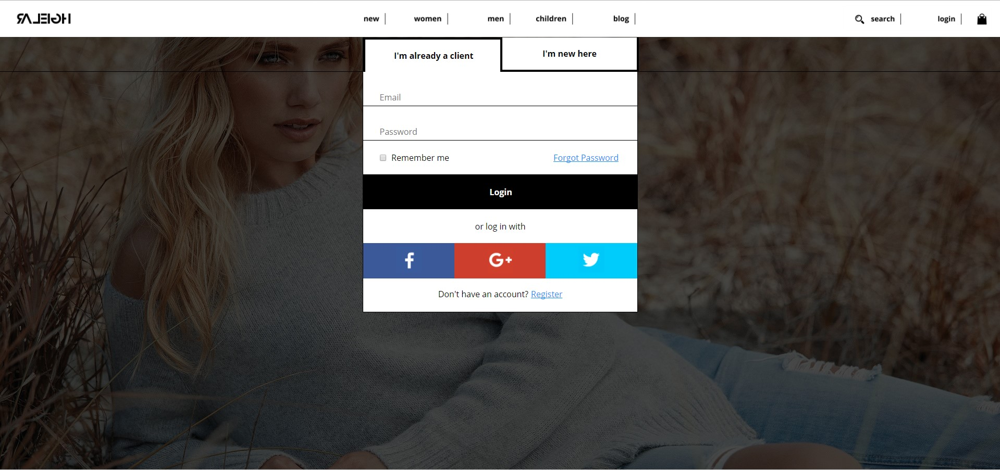

<h2>
Contact-form.css -A contact form for a tourism website
</h2>
<p>This is a contact form focused mainly on receiving feedback and suggestions from the client.
</p> 
<h3>Demo
</h3>
<hr>
<p>Here's how the form looks like:
</p>
  
<h3>How to use it
</h3>
 <hr>

 <p> 1. Insert links in your html file in your head section:
 </p>
```html
<head>
  <link rel="stylesheet" type="text/css" href="Contact-form.css">
</head>
```

<p>2. Copy the structure of HTML in your file to make sure the styles work correctly. The HTML and CSS have classes with names that will not interfere with your HTML file, unless doubled.
</p>

```html
<form class="form-section">
        <div class="big-square">
            <header>
                <h1>
                    *Your form name*
                </h1>
            </header>
            <div class="column-50-1">
                    <div class="row">
                        <label>
                            *Label Name*
                        </label>
                        <div class="input-container">
                            <input type="text">
                        </div>
                    </div>
                <div class="column-50-2">
                    <input type="submit" value="*Button name*">
                </div>
            </div>
        </div>
    </form>
```

<p>
  For each information you want in your form use the template above and add a new div with the class "row" and in it put your label and a div with the class "input-container" in which to put the input. 
</p>

<h3>Notes
</h3>
 <hr>
 <ul>
  <li>Don't use same CSS class name: "form-section"</li>
  <li>Form is not mobile ready(responsive)</li>
  <li>Styled inputs are: text, email, select, textarea, checkbox</li>
</ul>

